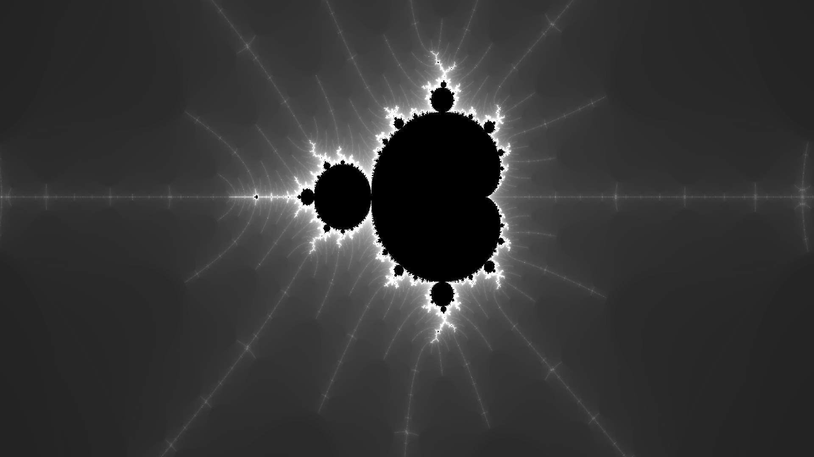
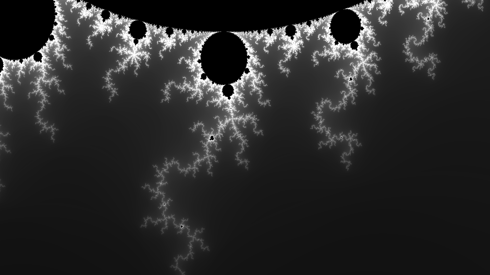
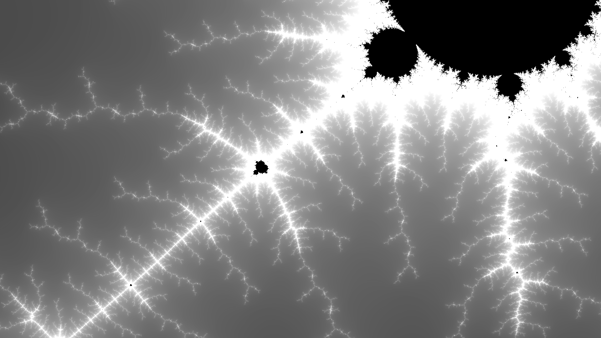
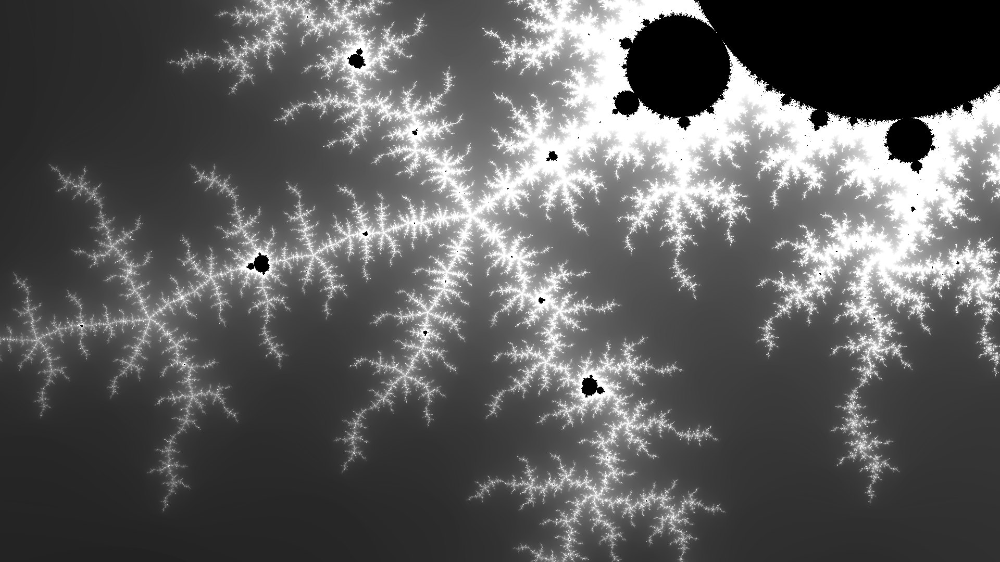
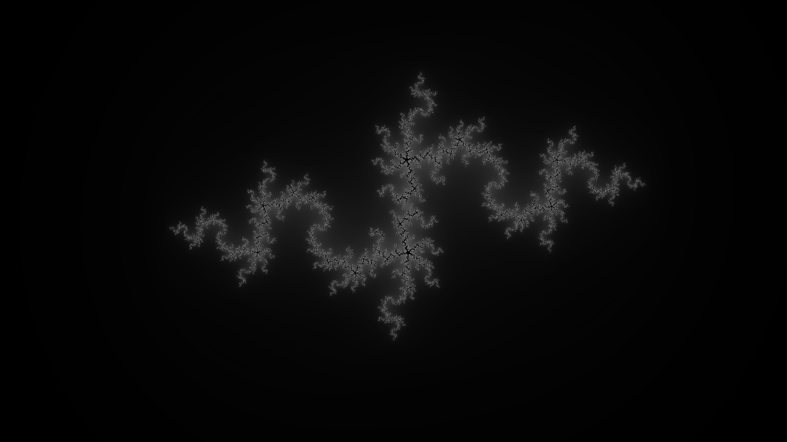
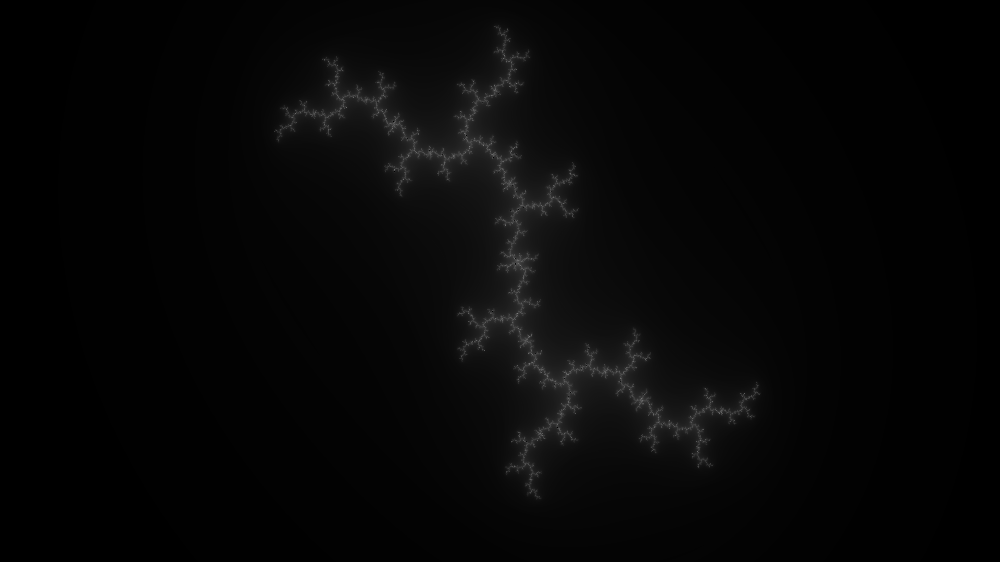
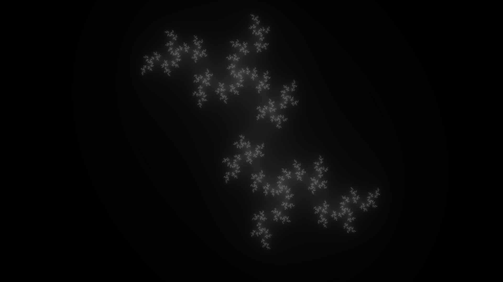

# Fractals

This is a fractal generator which can generate Mandelbrot and Julia set. I has been done using c++, OpenGL and SDL2 and OpenGL shader language, GLSL. 

## Building

### Prerequisites

- g++
- make
- SDL2
- OpenGL


### Building

```bash
make
```

### Running

for the mandelbrot set : 
```bash 
./build/fractals 
``` 


for the julia set :
```bash
./build/fractals -julia
``` 

## Examples

### Mandelbrot set










### Julia set






